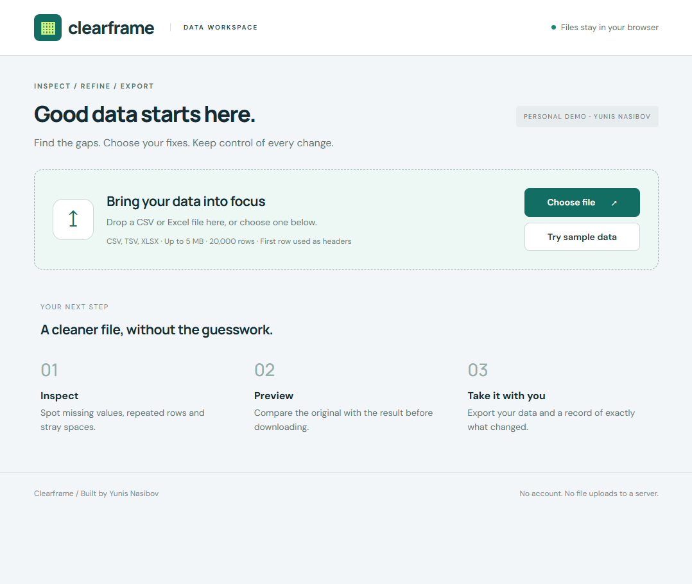
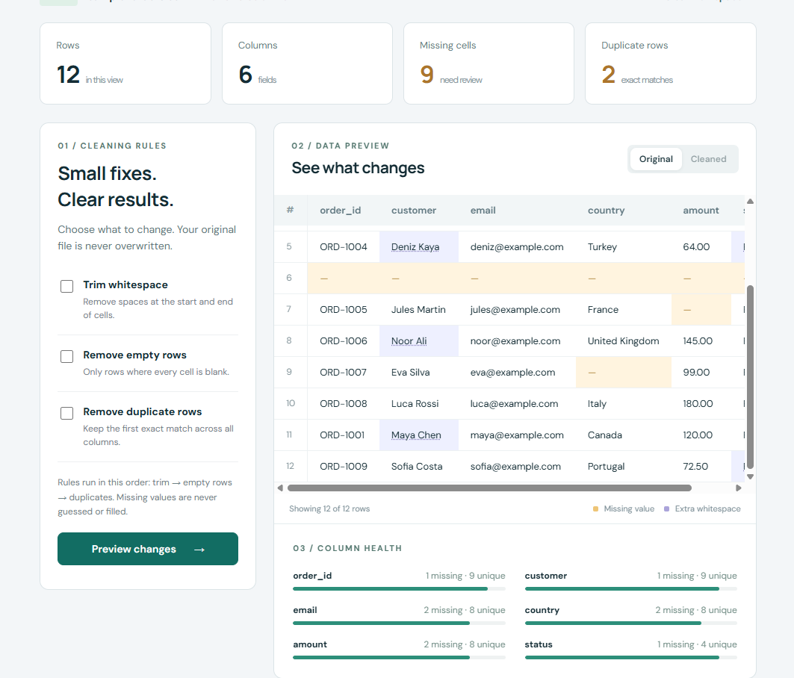
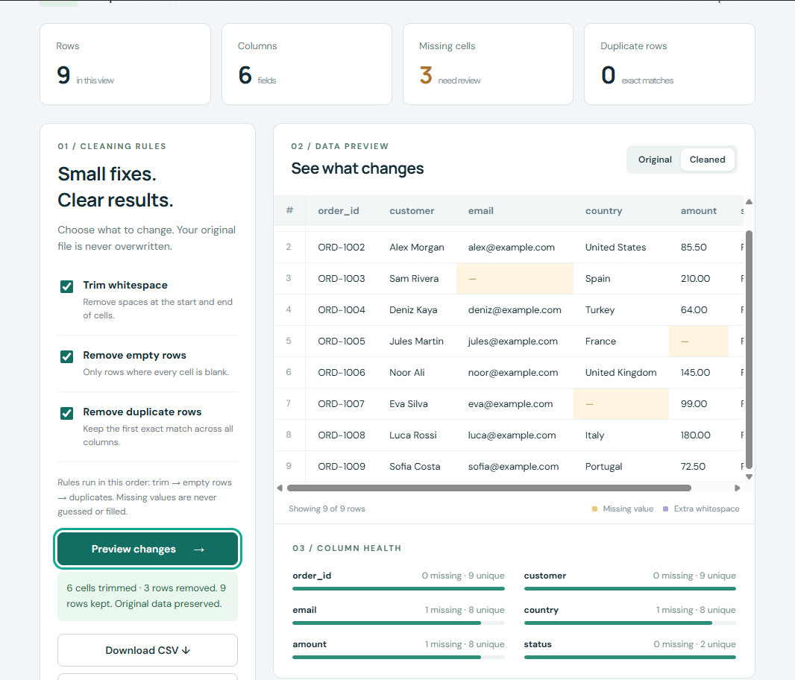

# Clearframe

A privacy-first CSV and Excel data cleaning workspace for turning messy spreadsheets into clean, reviewable datasets.

Clearframe lets users import spreadsheet data, identify common quality issues, apply cleaning operations, review exactly what changed, and export the cleaned result — all directly in the browser.

## How It Works

**Import → Analyze → Clean → Review Changes → Export**

**Built with:** JavaScript · HTML · CSS · Node.js

## Screenshots

### Workspace



### Before Cleaning



### After Cleaning



## What Clearframe Does

- Imports CSV, TSV, and XLSX files
- Detects common data quality issues
- Trims inconsistent whitespace
- Identifies and removes duplicate rows
- Normalizes blank and duplicate column headers
- Preserves missing values instead of guessing data
- Shows a preview of the dataset before export
- Tracks original and revised values
- Generates a detailed change report
- Exports cleaned datasets as CSV or XLSX
- Processes file contents locally in the browser

## Privacy by Design

Clearframe is designed to process spreadsheet contents locally.

There are:

- No file uploads to a server
- No user accounts
- No database
- No API keys
- No telemetry

Imported file contents remain in browser memory and disappear when the page is reloaded.

## Data Cleaning

### Duplicate Rows

Exact duplicate rows are detected across all fields.

Whitespace trimming runs before duplicate detection so inconsistencies caused by leading or trailing spaces can be cleaned first.

### Headers

Blank or duplicate column names are automatically normalized into unique headers.

### Missing Values

Blank values are preserved.

Clearframe does not attempt to invent or automatically impute missing information.

### Irregular CSV Files

Ragged CSV rows can be normalized by padding missing fields and generating headers when additional columns are encountered.

## Change Tracking

Clearframe keeps cleaning operations transparent.

The change report records original and revised values so users can understand what was modified instead of receiving a cleaned file with unexplained changes.

## Export

Cleaned datasets can be exported as:

- CSV
- XLSX

CSV export protects formula-like values by prefixing them to reduce accidental spreadsheet formula execution.

XLSX export is available when exact string preservation is preferred.

## Technical Details

### Architecture

Clearframe is intentionally lightweight and does not require a backend or database.

```text
Spreadsheet
    ↓
Browser Import
    ↓
Parsing & Validation
    ↓
Quality Analysis
    ↓
Cleaning Operations
    ↓
Change Tracking
    ↓
Preview
    ↓
CSV / XLSX Export
```

### Project Structure

```text
src/core.mjs
CSV parsing, quality analysis, cleaning and serialization

src/xlsx.mjs
XLSX import and export

src/app.mjs
Application state, file handling and interface logic

src/style.css
Responsive interface

tests/
Deterministic data-processing tests

scripts/
Build and local development utilities

samples/
Fictional sample datasets
```

## Run Locally

Requires **Node.js 20+**.

No package installation is required.

```bash
node scripts/build.mjs
node scripts/serve.mjs
```

Then open:

```text
http://127.0.0.1:4173
```

Run the automated tests with:

```bash
node --test tests/core.test.mjs
```

## Supported Files

Clearframe supports:

- UTF-8 CSV
- TSV
- XLSX

Current limits:

- 5 MB compressed input
- 50 MB declared expanded workbook content
- 20,000 data rows
- 200 columns

Legacy `.xls` files, encrypted workbooks, and macros are not supported.

XLSX import uses stored cell values. Spreadsheet formulas are not calculated, and formatting such as styles and merged cells is not preserved in values-only exports.

The preview displays the first 100 rows while cleaning and exports operate on the complete imported dataset.

## Validation

Automated tests cover:

- CSV quoting
- Multiline cells
- Delimiter handling
- Leading-zero preservation
- Malformed input
- Header normalization
- Immutable cleaning
- Operation ordering
- Blank values
- Duplicate detection
- Export behavior

Exported XLSX files have also been independently read using `openpyxl`.

The included sample cleaning workflow transforms **12 sample rows into 9 rows while retaining 3 missing cells**.

## Demo Data

The repository includes fictional sample datasets for demonstrating the complete cleaning workflow.

No real customer data or performance metrics are claimed.

## Project Scope

Clearframe is a portfolio implementation demonstrating browser-based spreadsheet processing, transparent data cleaning, and safe export workflows.

Additional browser and third-party workbook compatibility testing would be required before treating the project as a production data-processing service.
